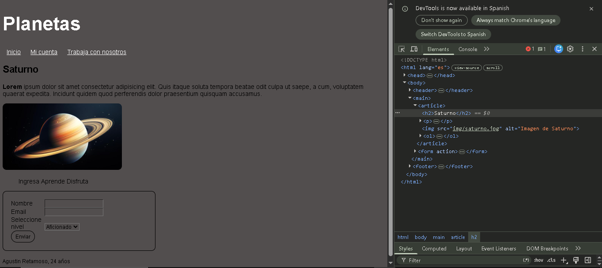

Proyecto REACT - modulo 1
Planetas

Este proyecto consiste en una página web desarrollada con HTML5 y CSS3 como parte del diplomado Full Stack.

La página incluye:
Menú de navegación.
Imagen con estilos CSS.
Formulario con estilos CSS.
Uso de selectores ID y class.
y demas estructuras y propiedades aprendidas.

Instrucciones para clonar el repositorio

Entrar: https://github.com/AgustinR3/REACT-1.git

Abrir la carpeta del proyecto.

Ejecutar el archivo index.html en un navegador web.

Autor

Nombre: Agustín Ignacio Retamoso

Curso: Diplomado Full Stack

Bibliografía y créditos

W3Schools:
https://www.w3schools.com/

Créditos de imágenes
Imagen de Saturno obtenida de:

https://starwalk.space/es/news/facts-about-saturn-explore-the-amazing-ringed-planet
